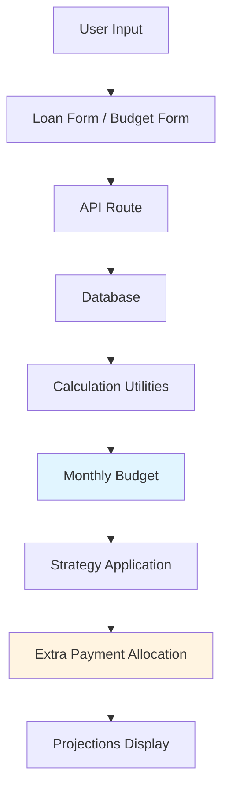

# Loan Payment Strategy Management System

## Overview

Build a comprehensive loan management system that tracks loans from multiple sources (banks, mobile apps, direct person-to-person loans), supports payment strategies (snowball, avalanche, custom priority), and provides payoff projections and calculations.

## Core Data Requirements

### Essential Loan Information

**Loan Identification:**

- Loan source type (bank, mobile_app, person)
- Lender name/identifier
- Loan account number/reference

**Financial Details:**

- Principal amount (original loan amount)
- Current balance
- Interest rate (APR - Annual Percentage Rate)
- Loan term (duration in months or end date)
- Start date
- Minimum payment amount
- Payment frequency (monthly, bi-weekly, weekly)

**Payment Management:**

- Next payment due date
- Payment status (current, upcoming, overdue)
- Payment priority (for strategy ranking)

**Strategy Configuration:**

- Strategy type (snowball, avalanche, custom)
- Priority order (for custom strategy)

### Monthly Budget Information

- Monthly allocated money (salary/allotted funds for debt payments)
- Effective date for budget
- Budget history (if budget changes over time)

### Calculated/Projected Data

- Total monthly payment obligation across all loans
- Available extra funds (monthly allocation - total minimum payments)
- Projected payoff date (based on minimum payments)
- Projected payoff date (based on strategy with available budget)
- Total interest to be paid (minimum vs strategy)
- Interest savings from strategy
- Time savings from strategy
- Extra payment allocation per loan (based on strategy and available budget)

## Database Schema Design

### Tables

**1. `loans` Table** - Core loan information

- `id` (serial, primary key)
- `source_type` (enum: 'bank', 'mobile_app', 'person')
- `lender_name` (varchar) - Name of bank/app/person
- `account_number` (varchar, nullable) - Loan account/reference number
- `principal_amount` (decimal) - Original loan amount
- `current_balance` (decimal) - Current outstanding balance
- `interest_rate` (decimal) - APR as percentage (e.g., 5.5 for 5.5%)
- `loan_term_months` (integer) - Total loan duration
- `start_date` (date) - Loan start date
- `payment_frequency` (enum: 'monthly', 'bi_weekly', 'weekly')
- `minimum_payment` (decimal) - Minimum required payment
- `next_payment_due_date` (date) - Next payment due date
- `payment_status` (enum: 'current', 'upcoming', 'overdue')
- `strategy_type` (enum: 'snowball', 'avalanche', 'custom', null)
- `priority_order` (integer, nullable) - For custom strategy ranking
- `is_active` (boolean) - Whether loan is still active
- `created_at` (timestamp)
- `updated_at` (timestamp)

**2. `upcoming_payments` Table** - Track upcoming/scheduled payments

- `id` (serial, primary key)
- `loan_id` (integer, foreign key to loans)
- `due_date` (date)
- `amount_due` (decimal)
- `amount_paid` (decimal, nullable)
- `status` (enum: 'pending', 'paid', 'overdue', 'missed')
- `paid_date` (date, nullable)
- `created_at` (timestamp)
- `updated_at` (timestamp)

**3. `monthly_budget` Table** - Store monthly allocated money for debt payments

- `id` (serial, primary key)
- `monthly_allocation` (decimal) - Monthly salary/allotted money for debt payments
- `effective_date` (date) - When this budget becomes effective
- `is_active` (boolean) - Whether this is the current active budget
- `notes` (text, nullable) - Optional notes about the budget
- `created_at` (timestamp)
- `updated_at` (timestamp)

## Implementation Plan

### Phase 1: Database Schema

**File: `lib/db/schema.ts`**

- Define `loans` table with all required fields
- Define `upcoming_payments` table
- Define `monthly_budget` table for storing monthly allocated money
- Create PostgreSQL enums for source_type, payment_frequency, payment_status, strategy_type
- Export TypeScript types using `$inferSelect` and `$inferInsert`
- Add indexes on frequently queried fields (source_type, payment_status, next_payment_due_date, is_active for monthly_budget)

### Phase 2: API Routes

**File: `app/api/loans/route.ts`**

- `GET /api/loans` - Fetch all loans with optional filtering
- `POST /api/loans` - Create new loan entry
- Support query parameters: `?source_type=bank&status=active`

**File: `app/api/loans/[id]/route.ts`**

- `GET /api/loans/[id]` - Get single loan details
- `PUT /api/loans/[id]` - Update loan information
- `DELETE /api/loans/[id]` - Mark loan as inactive/deleted

**File: `app/api/loans/strategy/route.ts`**

- `GET /api/loans/strategy` - Get loans ordered by current strategy
- `POST /api/loans/strategy` - Update strategy type and priorities
- Calculate and return strategy projections

**File: `app/api/loans/projections/route.ts`**

- `GET /api/loans/projections` - Calculate payoff projections
- Return minimum payment scenario vs strategy scenario
- Calculate interest savings, time savings, extra payment allocations

**File: `app/api/payments/route.ts`**

- `GET /api/payments` - Get upcoming payments (with loan details)
- `POST /api/payments` - Record payment made
- Support filtering by due date range, status

**File: `app/api/payments/[id]/route.ts`**

- `PUT /api/payments/[id]` - Update payment status
- `DELETE /api/payments/[id]` - Remove payment record

**File: `app/api/budget/route.ts`**

- `GET /api/budget` - Get current active monthly budget
- `POST /api/budget` - Create new monthly budget entry
- Support query parameters: `?active=true` to get only active budget

**File: `app/api/budget/[id]/route.ts`**

- `GET /api/budget/[id]` - Get specific budget entry
- `PUT /api/budget/[id]` - Update budget entry
- `DELETE /api/budget/[id]` - Deactivate budget entry

### Phase 3: Calculation Utilities

**File: `lib/loan-calculations.ts`**

- `calculatePayoffDate()` - Calculate payoff date based on payment schedule
- `calculateTotalInterest()` - Calculate total interest to be paid
- `calculateStrategyProjections()` - Calculate snowball/avalanche projections (uses monthly budget)
- `calculateExtraPaymentAllocation()` - Distribute extra payments based on strategy and available budget
- `calculateMonthlyObligation()` - Sum all minimum payments
- `calculateAvailableExtraFunds()` - Calculate available extra funds (monthly allocation - total minimum payments)
- `distributeBudgetAcrossLoans()` - Distribute monthly budget across loans based on strategy

**File: `lib/strategy-helpers.ts`**

- `sortBySnowball()` - Sort loans by current balance (smallest first)
- `sortByAvalanche()` - Sort loans by interest rate (highest first)
- `sortByCustom()` - Sort loans by priority_order
- `applyStrategy()` - Apply strategy and calculate new payment allocations

### Phase 4: UI Components

**File: `app/loans/page.tsx`** - Main loans overview page

- Table view of all loans
- Summary cards (total debt, monthly obligation, etc.)
- Filter by source type, status
- Sort by various columns

**File: `app/loans/components/loans-table.tsx`** - Loans data table

- Display all loan information
- Sortable columns
- Status indicators (current, overdue, etc.)
- Action buttons (edit, view details)

**File: `app/loans/components/loan-form.tsx`** - Add/edit loan form

- Form fields for all loan properties
- Validation using Zod schema
- React Hook Form integration

**File: `app/loans/components/strategy-selector.tsx`** - Strategy selection component

- Radio buttons for strategy type (snowball, avalanche, custom)
- Drag-and-drop priority ordering for custom strategy
- Preview of strategy impact

**File: `app/loans/components/projections-panel.tsx`** - Projections display

- Side-by-side comparison (minimum vs strategy)
- Charts/graphs for visual comparison
- Interest savings, time savings metrics
- Extra payment allocation breakdown

**File: `app/loans/components/payments-overview.tsx`** - Upcoming payments view

- Calendar view or list view of upcoming payments
- Payment status indicators
- Quick payment recording

**File: `app/loans/components/summary-cards.tsx`** - Dashboard summary

- Total debt across all loans
- Total monthly payment obligation
- Monthly allocated budget
- Available extra funds (budget - minimum payments)
- Next payment due (earliest)
- Overdue payments count
- Total interest to be paid

**File: `app/loans/components/budget-manager.tsx`** - Monthly budget management component

- Display current active monthly budget
- Form to set/update monthly allocation
- Budget history view (if multiple budget entries exist)
- Visual indicator of budget utilization (budget vs minimum payments)

### Phase 5: Data Validation

**File: `lib/validations/loan-schema.ts`**

- Zod schema for loan creation/update
- Validation rules for interest rates, amounts, dates
- Source type validation

**File: `lib/validations/payment-schema.ts`**

- Zod schema for payment recording
- Date validation, amount validation

**File: `lib/validations/budget-schema.ts`**

- Zod schema for monthly budget creation/update
- Amount validation (must be positive)
- Date validation for effective_date

## Key Features

### Loan Overview Table

- Display all loans in sortable, filterable table
- Columns: Lender, Source, Balance, Interest Rate, Min Payment, Due Dte, Status
- Quick actions: Edit, View Details, Mark Paid

### Payment Strategy Management

- **Snowball Method**: Pay smallest balance first, then roll payment to next smallest
- **Avalanche Method**: Pay highest interest rate first, then roll payment to next highest
- **Custom Priority**: User-defined priority order
- Visual comparison of strategy impact

### Payoff Projections

- Calculate payoff dates for minimum payment scenario
- Calculate payoff dates for strategy scenario (using monthly allocated budget)
- Show interest savings from using strategy
- Show time savings (months/years saved)
- Extra payment allocation per loan (based on available budget after minimum payments)
- Budget utilization breakdown (how budget is distributed across loans)

### Payment Tracking

- Track upcoming payments
- Mark payments as made
- Identify overdue payments
- Update loan balances when payments recorded

## Data Flow

## Technical Considerations

1. **Decimal Precision**: Use `decimal` or `numeric` type for financial amounts (not float)
2. **Date Handling**: Use PostgreSQL `date` type, handle timezone in application
3. **Interest Calculations**: Support both APR and monthly rate conversions
4. **Payment Frequency**: Handle different payment frequencies (monthly, bi-weekly, weekly)
5. **Strategy Recalculation**: Recalculate projections when loans updated, payments made, or budget changed
6. **Balance Updates**: Update current_balance when payments recorded
7. **Validation**: Validate all financial inputs, prevent negative balances
8. **Budget Integration**: All strategy calculations must use monthly budget to determine extra payment allocations
9. **Budget Validation**: Ensure monthly allocation is sufficient for minimum payments (warn if insufficient)
10. **Active Budget**: Only one active budget at a time - new budget entries should deactivate previous ones

## Future Enhancements (Out of Scope for MVP)

- Payment history tracking (full historical record)
- Recurring payment scheduling
- Email/SMS reminders for due dates
- Integration with bank APIs