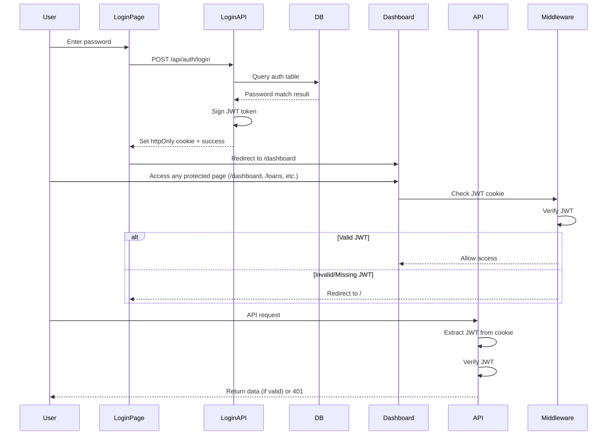

# Simple Password Authentication with JWT

## Overview

Implement a simple password-based authentication system that:

- Stores password in database `auth` table (plain text as requested)
- Issues JWT tokens on successful login (7-day expiration)
- Stores JWT in httpOnly cookies for security
- Protects ALL pages except root route (`/`) - including `/dashboard`, `/loans`, `/payments`, `/budget`, `/projections`, etc.
- Protects ALL API endpoints except `/api/auth/login`
- Moves current dashboard content from root to `/dashboard`

## Implementation Steps

### 1. Database Schema Updates

**File**: `lib/db/schema.ts`

- Add `auth` table with:
- `id`: serial primary key
- `password`: varchar (plain text as requested)
- `createdAt` and `updatedAt` timestamps
- Export types: `Auth` and `NewAuth`

**Migration**: Generate and run migration with `bun run db:generate` and `bun run db:push`

### 2. Dependencies

**File**: `package.json`

- Add `jose` library for JWT handling (Next.js/Edge compatible)
- Alternative: `jsonwebtoken` if not using Edge runtime

### 3. Authentication Utilities

**New File**: `lib/auth.ts`

- `signToken(payload)`: Sign JWT with 7-day expiration
- `verifyToken(token)`: Verify and decode JWT
- `getTokenFromRequest(request)`: Extract JWT from httpOnly cookie
- `verifyAuth(request)`: Verify authentication from request (returns boolean or throws)

**Environment Variable**: Add `JWT_SECRET` to `.env.local` (random secure string)

### 4. Login API Endpoint

**New File**: `app/api/auth/login/route.ts`

- POST endpoint that:
- Accepts `{ password: string }` in request body
- Queries `auth` table for password match
- If valid: Sign JWT and set httpOnly cookie, return success
- If invalid: Return 401 error
- Cookie settings:
- httpOnly: true
- secure: true (production)
- sameSite: 'strict'
- maxAge: 7 days

**New File**: `app/api/auth/logout/route.ts` (optional)

- POST endpoint to clear auth cookie

### 5. API Route Protection

**New File**: `lib/api-auth.ts`

- `requireAuth(request)`: Middleware helper that:
- Extracts JWT from cookie
- Verifies token
- Returns user info or throws error
- Can be used in API routes: `const user = await requireAuth(request)`

**Update API Routes**: Add authentication check to all existing API routes:

- `app/api/loans/route.ts`
- `app/api/loans/[id]/route.ts`
- `app/api/loans/strategy/route.ts`
- `app/api/loans/projections/route.ts`
- `app/api/payments/route.ts`
- `app/api/payments/[id]/route.ts`
- `app/api/budget/route.ts`
- `app/api/budget/[id]/route.ts`

### 6. Next.js Middleware

**New File**: `middleware.ts` (root level)

- **Protect ALL pages except root (`/`)**: 
- Redirect to `/` if no valid JWT for any route except `/`
- Protected routes include: `/dashboard`, `/loans`, `/payments`, `/payments/current`, `/payments/history`, `/budget`, `/projections`, and any future routes
- Only `/` (login page) is publicly accessible
- **Protect ALL API endpoints except login**:
- Allow `/api/auth/login` without authentication
- Protect all other `/api/*` routes (return 401 if no valid JWT)
- Extract JWT from cookie and verify for all protected routes

### 7. Login Page

**Update File**: `app/page.tsx`

- Replace dashboard content with login form
- Form includes:
- Password input field
- Submit button
- Error message display
- On successful login: redirect to `/dashboard`
- Use React Hook Form + Zod for validation

**New File**: `app/page.tsx` (login form component)

- Client component with form handling
- Calls `/api/auth/login` endpoint
- Handles success/error states

### 8. Dashboard Page

**New File**: `app/dashboard/page.tsx`

- Move current dashboard content from `app/page.tsx`
- Import `SummaryCards` component
- Protected by middleware (redirects if not authenticated)

### 9. Layout Updates

**Update File**: `app/layout.tsx`

- Conditionally render `Navigation` component:
- Hide on login page (`/`)
- Show on authenticated pages (`/dashboard`, etc.)
- Use pathname check or authentication state

### 10. Navigation Component

**Update File**: `app/components/navigation.tsx`

- Add logout functionality (calls `/api/auth/logout` or clears cookie)
- Only show when authenticated

## Authentication Flow




## Files to Create

1. `lib/auth.ts` - JWT utilities and auth helpers
2. `lib/api-auth.ts` - API route protection helper
3. `app/api/auth/login/route.ts` - Login endpoint
4. `app/api/auth/logout/route.ts` - Logout endpoint (optional)
5. `app/dashboard/page.tsx` - Dashboard page (moved from root)
6. `middleware.ts` - Next.js middleware for route protection

## Files to Modify

1. `lib/db/schema.ts` - Add auth table
2. `app/page.tsx` - Replace with login form
3. `app/layout.tsx` - Conditionally show navigation
4. `app/components/navigation.tsx` - Add logout
5. All API route files - Add authentication checks
6. `package.json` - Add jose dependency

## Environment Variables

Add to `.env.local`:

```javascript
JWT_SECRET=your-random-secure-string-here
```


## Testing Checklist

- [ ] Login with correct password sets cookie and redirects
- [ ] Login with incorrect password shows error
- [ ] All pages (except /) redirect to login if not authenticated
- [ ] Dashboard redirects to login if not authenticated
- [ ] Loans page redirects to login if not authenticated
- [ ] Payments pages redirect to login if not authenticated
- [ ] Budget page redirects to login if not authenticated
- [ ] Projections page redirects to login if not authenticated
- [ ] All API routes (except /api/auth/login) return 401 without valid JWT
- [ ] API routes work with valid JWT cookie
- [ ] Logout clears cookie and redirects to login
- [ ] JWT expires after 7 days
- [ ] Navigation hidden on login page

## Security Considerations

- JWT stored in httpOnly cookie (prevents XSS)
- Cookie uses secure flag in production
- SameSite strict prevents CSRF